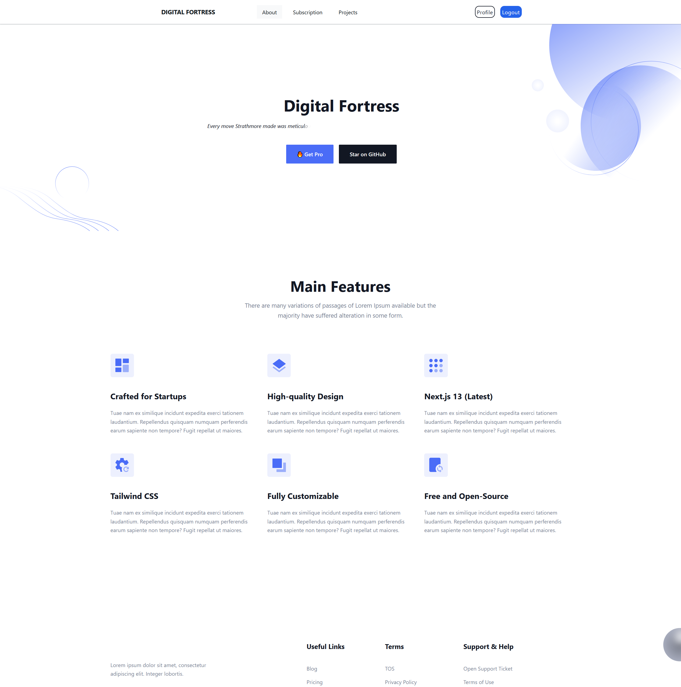
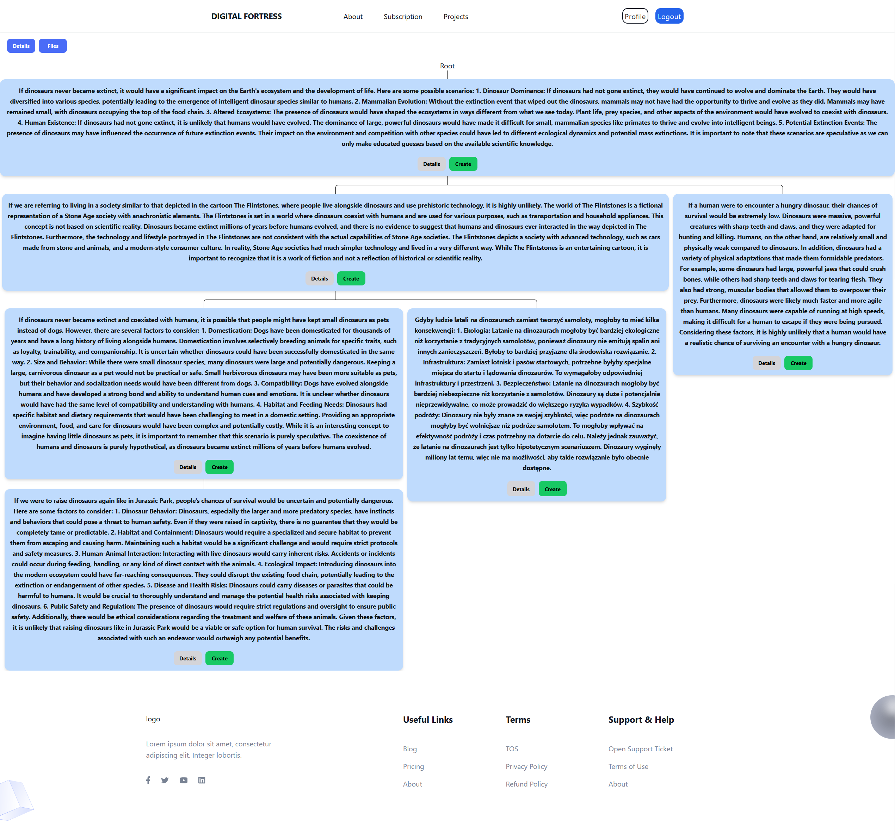
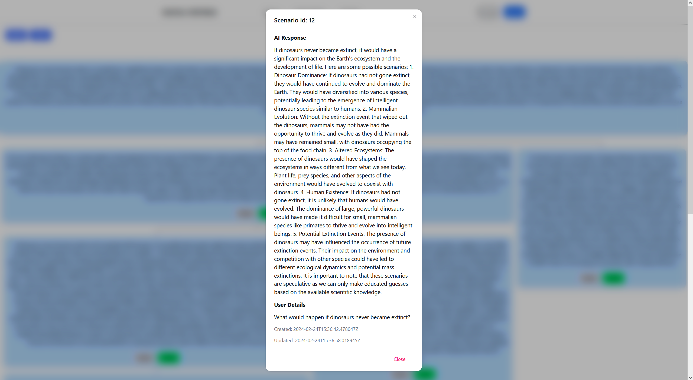
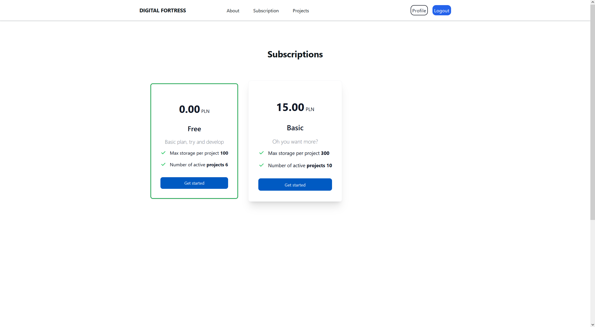
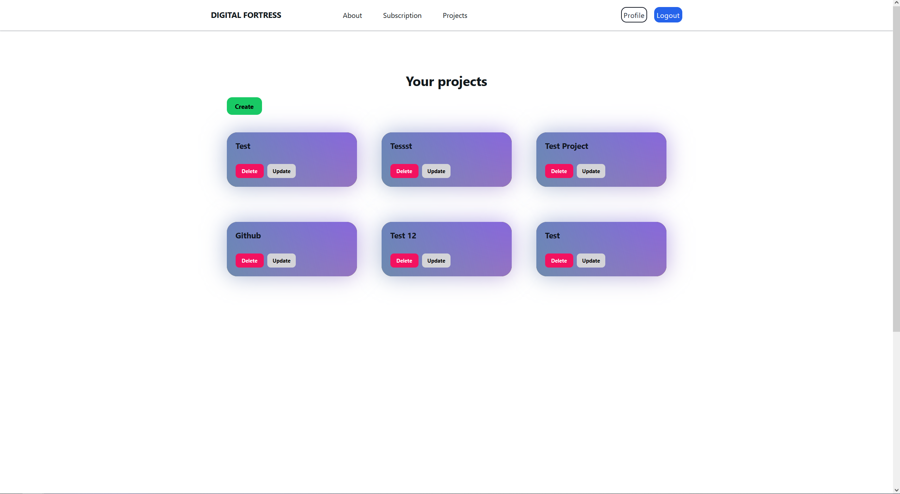
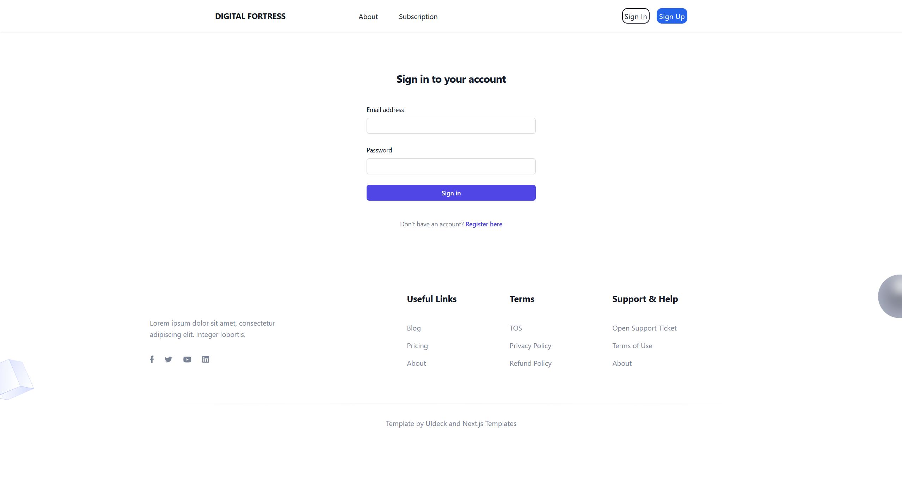
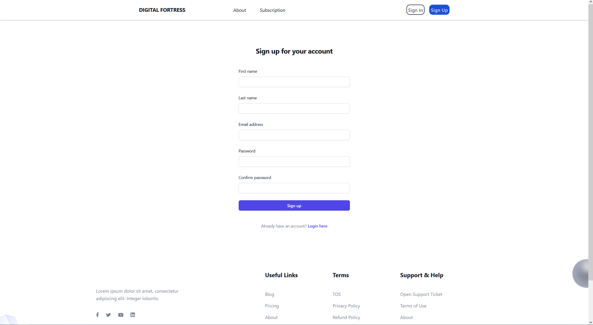
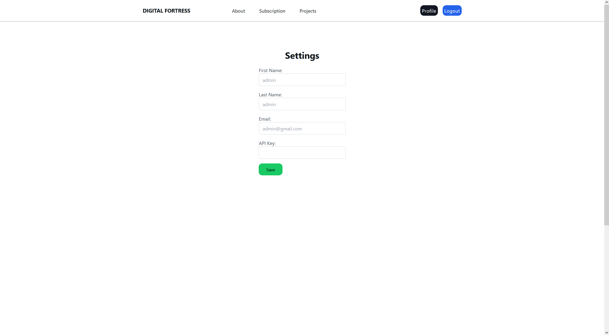

<a name="readme-top"></a>

[![Contributors][contributors-shield]][contributors-url]
[![Forks][forks-shield]][forks-url]
[![Stargazers][stars-shield]][stars-url]
[![Issues][issues-shield]][issues-url]
[![MIT License][license-shield]][license-url]
[![LinkedIn][linkedin-shield]][linkedin-url]


<br />
<div align="center">
  <h3 align="center">Digital Fortress</h3>

  <p align="center">
    Digital Fortress is a techno-thriller novel written by American author Dan Brown and published in 1998 by St. Martin's Press. The book explores the theme of government surveillance of electronically stored information on the private lives of citizens, and the possible civil liberties and ethical implications of using such technology.     <br />
    <br />
    <a href="https://github.com/DEENUU1/fjob_frontend/issues">Report Bug</a>
    ·
    <a href="https://github.com/DEENUU1/fjob_frontend/issues">Request Feature</a>
  </p>
</div>











## System Architecture


## Features
1. JWT and OAuth Google Integration:
   - Implements a robust authentication and authorization system through the synergistic use of JSON Web Tokens (JWT) and OAuth Google, ensuring a high level of security in the processes.

2. Langchain Framework Integration for Large Language Models:
   - Leverages the Langchain framework to seamlessly integrate and interact with large language models, optimizing the handling of extensive linguistic data.

3. Tree Data Structure for Scenario Interconnections:
   - Employing a sophisticated tree data structure to establish connections between individual scenarios. This enables the transparent construction of elaborate scenarios, enhancing the overall project structure.

4. Advanced File Processing and Capacity Management:
   - Implements advanced file processing techniques, including embedding, and provides robust management of project capacity constraints. Users can efficiently utilize and manage the maximum allowable capacity for their projects.

5. Subscription System for Enhanced Application Features:
   - Incorporates a subscription system that enables users to unlock additional application capabilities. Notably, the integration with the Stripe payment system is currently pending, adding a streamlined payment process to the subscription functionality.

## Technologies:
- Python
  - Django / Django Rest Framework
  - Langchain
  - Celery
  - Pytest
- Typescript
- React / NextJS
- Docker / Docker-compose
- Redis
- SQLite
- PostgreSQL
- Pinecone (vectore database)
- CI/CD


## Local environment installation

1. Clone repository
```bash
git clone "https://github.com/DEENUU1/digital-fortress.git"
```

2. Run backend 
```bash
# Create .env file based on .env_example
cp .env_example .env
```


- without docker
```bash
# Change directory to backend
cd backend/

# install all required libs
pip install -r requirements.txt

# Create superuser
python manage.py createsuperuser

# Start server
python manage.py runserver
```
- with docker 
```bash
docker-compose build

docker-compose up
```

3. Run frontend
```bash
# Create .env.local in frontend/ directory

NEXT_PUBLIC_HOST=http://localhost:3000
API_URL=http://127.0.0.1:8000/
```

```bash
# Change directory to frontend
cd frontend/

# Install deps
npm i 

# Run local server
npm run dev 
```


## Authors

- [@DEENUU1](https://www.github.com/DEENUU1)

<!-- LICENSE -->

## License

See `LICENSE.txt` for more information.


<!-- MARKDOWN LINKS & IMAGES -->
<!-- https://www.markdownguide.org/basic-syntax/#reference-style-links -->

[contributors-shield]: https://img.shields.io/github/contributors/DEENUU1/digital-fortress.svg?style=for-the-badge

[contributors-url]: https://github.com/DEENUU1/digital-fortress/graphs/contributors

[forks-shield]: https://img.shields.io/github/forks/DEENUU1/digital-fortress.svg?style=for-the-badge

[forks-url]: https://github.com/DEENUU1/digital-fortress/network/members

[stars-shield]: https://img.shields.io/github/stars/DEENUU1/digital-fortress.svg?style=for-the-badge

[stars-url]: https://github.com/DEENUU1/digital-fortress/stargazers

[issues-shield]: https://img.shields.io/github/issues/DEENUU1/digital-fortress.svg?style=for-the-badge

[issues-url]: https://github.com/DEENUU1/digital-fortress/issues

[license-shield]: https://img.shields.io/github/license/DEENUU1/digital-fortress.svg?style=for-the-badge

[license-url]: https://github.com/DEENUU1/digital-fortress/blob/master/LICENSE.txt

[linkedin-shield]: https://img.shields.io/badge/-LinkedIn-black.svg?style=for-the-badge&logo=linkedin&colorB=555

[linkedin-url]: https://linkedin.com/in/kacper-wlodarczyk

[basic]: https://github.com/DEENUU1/digital-fortress/blob/main/assets/v1_2/basic.gif?raw=true

[full]: https://github.com/DEENUU1/digital-fortress/blob/main/assets/v1_2/full.gif?raw=true

[search]: https://github.com/DEENUU1/digital-fortress/blob/main/assets/v1_2/search.gif?raw=true
